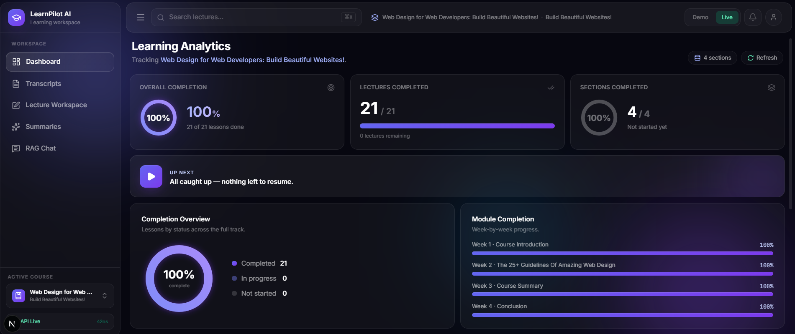
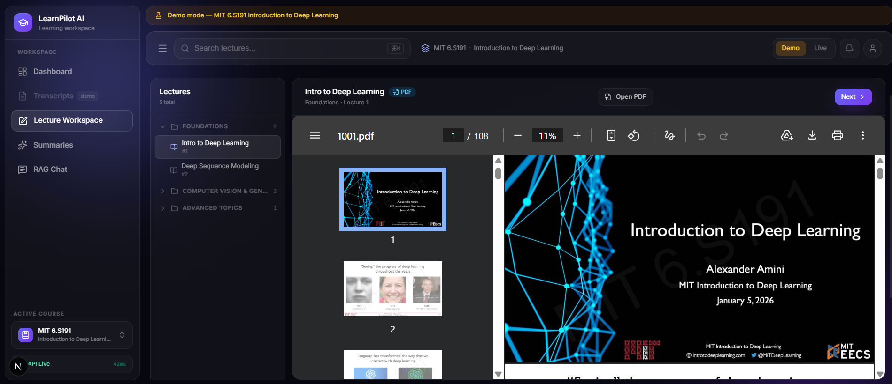
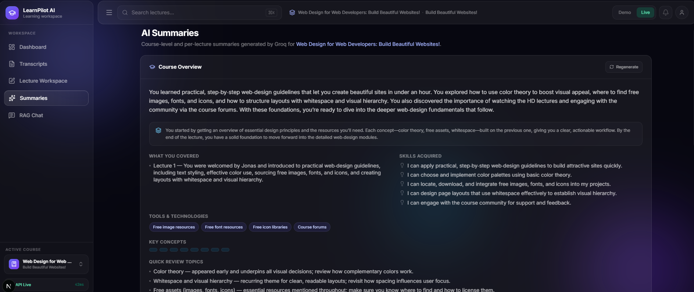
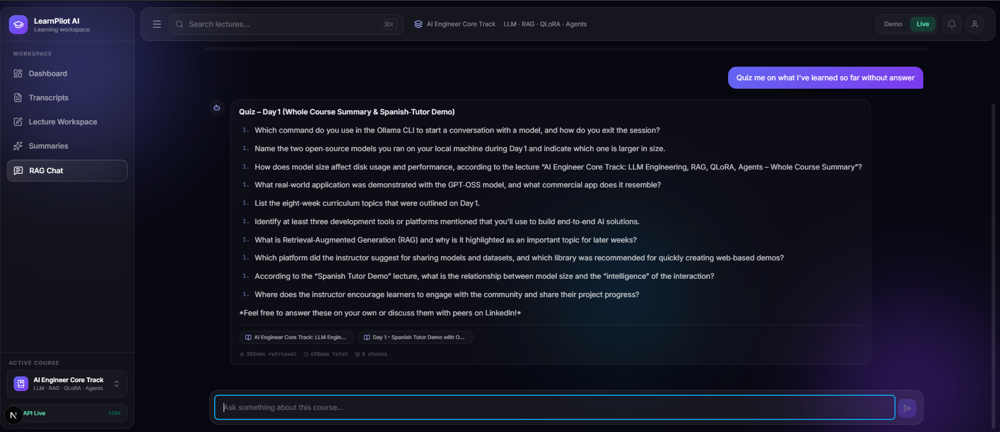
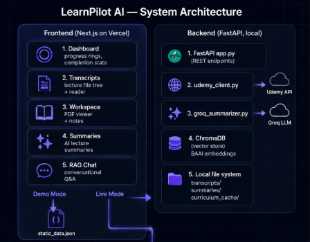
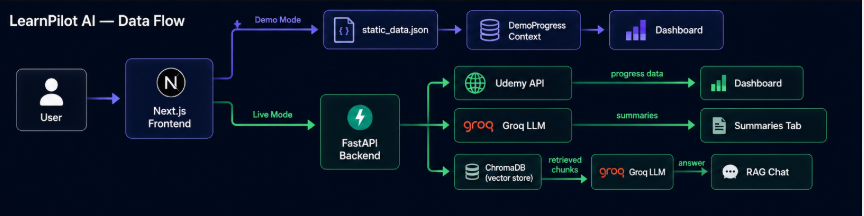
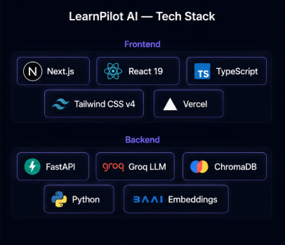

# 🚀 LearnPilot AI

> Don't restart learning. Resume it.

An AI-powered learning companion that helps learners reconnect with online course content through AI summaries, semantic search, and Retrieval-Augmented Generation (RAG).

**🌐 Live Demo → [learnpilot-iota.vercel.app](https://learnpilot-iota.vercel.app)**
**🎥 Demo Video → (LinkedIn post)**

<p align="center">
  
</p>

---

## Why LearnPilot AI?

One thing I noticed while taking online courses was that coming back after a short break was often harder than learning the material the first time.

I usually had three choices:
- Rewatch the lectures.
- Search through pages of notes.
- Copy sections into ChatGPT or Claude just to rebuild context.

I built LearnPilot AI to remove that friction.

Instead of treating a course as a collection of videos, LearnPilot AI turns it into an interactive learning workspace where you can:

- 📊 Track meaningful learning progress
- 📄 Read searchable lecture transcripts
- 🧠 Review AI-generated summaries
- 💬 Ask questions grounded in your own course using RAG

The goal isn't to replace learning.
It's to make it easier to reconnect with what you've already learned.

---

## Features

| Feature | Description |
|---|---|
| 📊 **Learning Dashboard** | Completion rings, module progress, section breakdown, Up Next card |
| 📄 **Transcript Reader** | Read and search any lecture transcript, cached locally |
| 🧠 **AI Summaries** | Per-lecture and full-course summaries via Groq LLM |
| 💬 **RAG Chat** | Ask questions about your course, answers grounded in indexed transcripts |
| 🎯 **Workspace** | PDF viewer + transcript side by side with auto-saved notes |
| 🌐 **Demo Mode** | Fully interactive demo using MIT 6.S191 (no backend needed) |
| 📱 **Mobile Responsive** | Full mobile support with touch-optimized navigation |
| 🔒 **Optional Auth** | Local password auth — app is fully usable without signing in |

---

## 📸 Application Preview

| Dashboard | Workspace |
|---|---|
|  |  |

| AI Summaries | RAG Chat |
|---|---|
|  |  |

---

## Architecture

### System Architecture



The app has two columns — a Next.js frontend deployed on Vercel, and a local FastAPI backend that connects to Udemy, Groq, and ChromaDB. The frontend operates in **Demo mode** (no backend needed) or **Live mode** (connects to your local backend).

### Frontend

```
Next.js 16 (App Router)
│
├── app/                        # Pages (App Router)
│   ├── dashboard/              # Progress analytics
│   ├── transcripts/            # Transcript reader
│   ├── workspace/              # PDF + transcript + notes
│   ├── summaries/              # AI lecture summaries
│   ├── chat/                   # RAG chat interface
│   └── login/                  # Optional auth
│
├── components/
│   ├── layout/                 # AppShell, Sidebar, Header, UserMenu
│   ├── dashboard/              # KPI cards, rings, section accordion
│   ├── workspace/              # LecturePicker, WorkspacePanel
│   ├── summaries/              # Summary cards and pickers
│   └── chat/                   # Chat bubbles, composer
│
├── hooks/                      # Data fetching (useProgress, useLectures, etc.)
├── context/                    # AppMode, DemoProgress, Auth
└── lib/
    ├── api.ts                  # All API calls + demo mode branching
    └── types.ts                # Shared TypeScript types
```

### Backend

```
FastAPI (Python)
│
├── app.py                      # All REST endpoints
│   ├── GET  /health
│   ├── GET  /progress          # Always live from Udemy (no cache)
│   ├── GET  /lectures          # Curriculum + transcript cache status
│   ├── GET  /transcript/{id}   # Fetch + cache transcript
│   ├── GET  /summary/{id}      # Generate + cache lecture summary
│   ├── GET  /summary/course    # Full course summary
│   ├── GET  /summary/status    # Which lectures have summaries cached
│   ├── POST /rag/ask           # RAG question answering
│   └── GET  /rag/courses       # Which courses are indexed
│
├──── udemy_client.py             # Reverse-engineered Udemy client
│   ├── Authentication
│   ├── Course Progress
│   ├── Curriculum
│   ├── Lecture Transcripts
│   └── Local Cache
Local Cache           # Udemy API scraper (progress + transcripts)
├── groq_summarizer.py          # Groq LLM (summarisation)
├── chunking.py                 # Transcript → chunks for RAG
├── embedding_store.py          # ChromaDB vector store
└── rag_chat.py                 # Retrieval + answer generation
```

### Data Flow



---

## Tech Stack



### Frontend
| Technology | Version | Purpose |
|---|---|---|
| Next.js | 16.2.9 | App Router, SSR, routing |
| React | 19 | UI framework |
| TypeScript | 5 | Type safety |
| Tailwind CSS | v4 | Styling (CSS custom properties) |
| Lucide React | latest | Icons |

### Backend
| Technology | Purpose |
|---|---|
| FastAPI | REST API framework |
| Groq (`openai/gpt-oss-120b`) | LLM for summaries + RAG answers |
| ChromaDB | Local vector database |
| `BAAI/bge-small-en-v1.5` | Sentence embeddings |
| `curl_cffi` | Udemy API scraping (TLS fingerprinting) |

---

## Engineering Decisions

A few implementation decisions that shaped the project:

- **Demo Mode** allows anyone to explore the application without requiring API keys or a running backend.
- **Live Mode** connects directly to the FastAPI backend for real Udemy progress, transcript retrieval, AI summaries, and RAG chat.
- **React Context + Custom Hooks** were chosen over Redux to keep state management lightweight.
- **Progress data is always fetched live**, while curriculum metadata is cached separately to reduce unnecessary API calls.
- **ChromaDB + BAAI embeddings** provide semantic retrieval for the RAG pipeline.
- **Groq LLM** powers both lecture summarization and grounded question answering.

---

## API Integration & Reverse Engineering

One of the most challenging parts of this project wasn't the AI pipeline—it was understanding how to retrieve course data reliably.

Since the required Udemy APIs aren't documented for this use case, I analyzed network requests, identified the endpoints used by the web application, and built a Python client to retrieve:

- Course curriculum
- Learning progress
- Lecture transcripts
- Course metadata

The client handles authentication, response parsing, local caching, and provides a clean interface for the FastAPI backend.

This allowed LearnPilot AI to work with real course data instead of manually prepared datasets.

---

## Demo Mode

The live demo at [learnpilot-iota.vercel.app](https://learnpilot-iota.vercel.app) runs entirely without a backend using **MIT 6.S191 Introduction to Deep Learning** as sample data.

- 5 lectures with real transcripts (OCR from MIT OpenCourseWare slides)
- AI-generated summaries for all 5 lectures + full course summary
- ~25 pre-generated Q&A pairs for the RAG chat
- Progress tracking via the **Next** button in Workspace (in-memory)

---

## Running Locally

### Prerequisites
- Node.js 18+
- Python 3.10+
- A Udemy account
- A Groq API key

### Frontend
```bash
cd udemy-tracker
npm install
npm run dev
```

### Backend
```bash
cd Udemy-scrapper-backend
pip install -r requirements.txt

# Add your credentials to .env
cp .env.example .env

uvicorn app:app --reload
```

`.env` needs:
```
UDEMY_EMAIL=your@email.com
UDEMY_PASSWORD=yourpassword
GROQ_API_KEY=your_groq_key
```

Then open `http://localhost:3000` and click the **Live** toggle in the top right to connect to your backend.

---

## Project Structure

```
learnpilot/
├── udemy-tracker/              # Next.js frontend (this repo)
└── Udemy-scrapper-backend/     # FastAPI backend (local only, not committed)
```

> **Note**
>
> The public deployment runs entirely in **Demo Mode**, allowing anyone to explore the application without API keys or a hosted backend.
>
> The FastAPI backend is maintained locally because it contains personal Udemy credentials, cached course data, and API keys.
>
> The complete backend architecture and implementation are documented above.

---

## Roadmap

- [x] Vercel deployment with demo mode
- [x] Multi-course support
- [x] Mobile responsive
- [ ] Spaced repetition quiz mode
- [ ] Export notes as PDF
- [ ] Support for other platforms (Coursera, YouTube)
- [ ] Browser extension for automatic progress sync

---

## Built to Learn

LearnPilot AI started as a personal project while I was learning AI.

Along the way it helped me better understand retrieval pipelines, vector embeddings, semantic search, prompt engineering, and building production-style AI applications.

More importantly, it reinforced one idea:

> AI doesn't always need to generate something new. Sometimes the most valuable thing it can do is help us reconnect with knowledge we've already earned.

If LearnPilot AI helps even one learner get back into a course instead of giving up halfway through, then it has already achieved its goal.

---

## License

MIT — feel free to fork and adapt for your own learning stack.